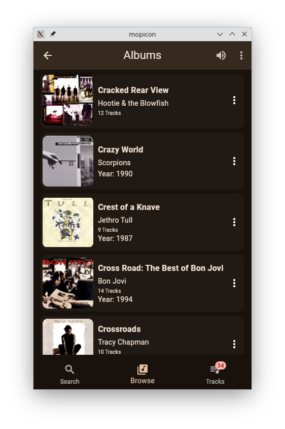
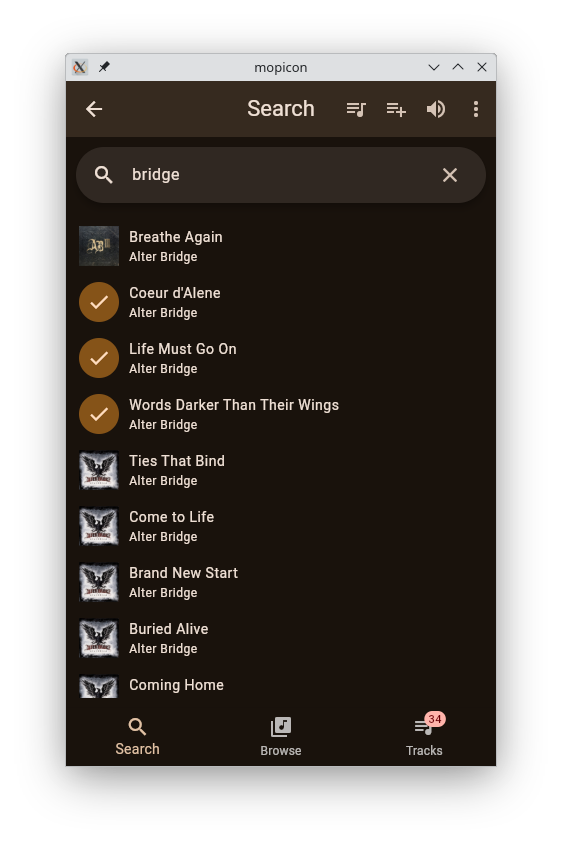
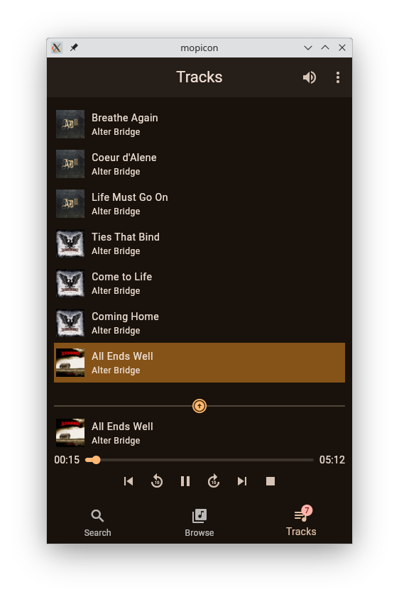
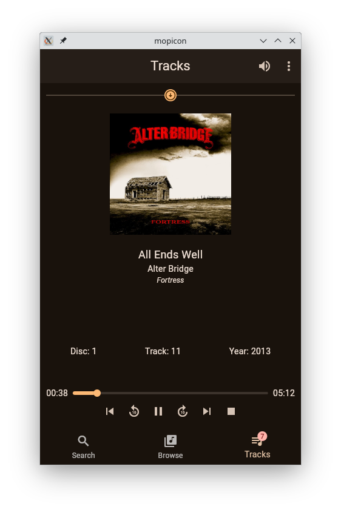
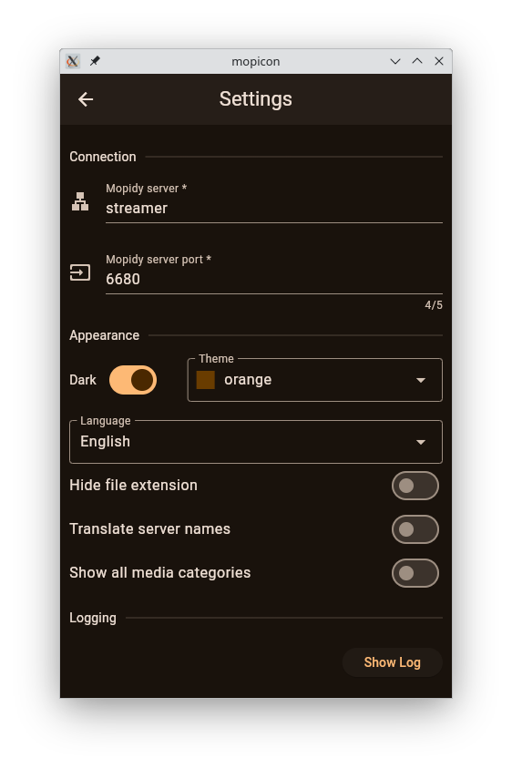

= Mopicon

A client for https://mopidy.com[Mopidy] implemented with Flutter and Dart.

Although Mopicon is styled as an Android app, it compiles into a native application on other platforms
as well. It also compiles into a Web application and could also be turned  into a Mopidy
server-side extension by implementing the necessary Python boilerplate (which does not exist, yet).

== Some Screenshots

.Browsing the library
{nbsp}

.Searching

.Tracklist Split- and Fullscreen views
{nbsp}
{nbsp}

The list of search results, tracklist and playlists all support item selection
by dragging an item from left to right. Selection can also be performed by a
long mouse button press. Once one item is selected, additional items can be selected or deselected
by tapping an item. Additionally, in playlists and in the tracklist, items can be reordered
by vertically dragging an item to a new position.

.Settings

== Plenty of clients exist, why yet another Mopidy client?

The main reasons I started this project:

* I wanted to learn Dart and Flutter.
* As far as I know, native client apps for Android do not exist. There are some
native Android clients for the http://www.musicpd.org[Music Player Daemon] which could
be used if the https://mopidy.com/ext/mpd[Mopidy-MPD] extension is installed on your server.
* I wanted to build the UI to my very personal taste. 

DISCLAIMER:: This is my very first Flutter/Dart project. Take the code with a grain of salt.

== Getting Started

=== Prerequisites

First of all, you need a properly configured Mopidy server. See the https://mopidy.com/[Mopidy]
website for details about installing and configuration.

In order to run or build the application, you need at least `Dart 3.0.0` and `Flutter 3.13.0`
installed.

=== Running the Application

Clone this repository and execute

   flutter run

If your Mopidy server is not running on `localhost:6680`, you need to set the correct
host and port for your server on Mopicon's `Settings` screen.

NOTE:: If you select a web browser as output device from the displayed list of
connected devices, album covers and thumbnails will not be loaded and displayed, because
of the browser's security restrictions. This would only work if the Mopicon web
application is loaded from the Mopidy host and port, if Mopicon is installed
as a Mopidy extension, for example.

In order to build the application as an executable on Linux, for example, invoke

    flutter build linux

== Development

For Development, I used Android Studio 2022.3.1 with `Flutter Intl` plugin installed.

This project uses my https://github.com/nerk/mopidy_dart_client[mopidy_dart_client] library
for communicating via a Websocket to the Mopidy server.

== TODO

The application is already fully functional and usable. Some things to be improved
or missing are:

* Help documentation.
* Shuffle/repeat for tracklist.
* Python project for installing the web application as a Mopidy extension.
* Provide ready to install packages for different target machines.
* Put Android app on Google Playstore.

== Copyright and License

Copyright (C) 2023 Thomas Kern

Licensed under MIT License. See link:LICENSE[LICENSE] for details.

